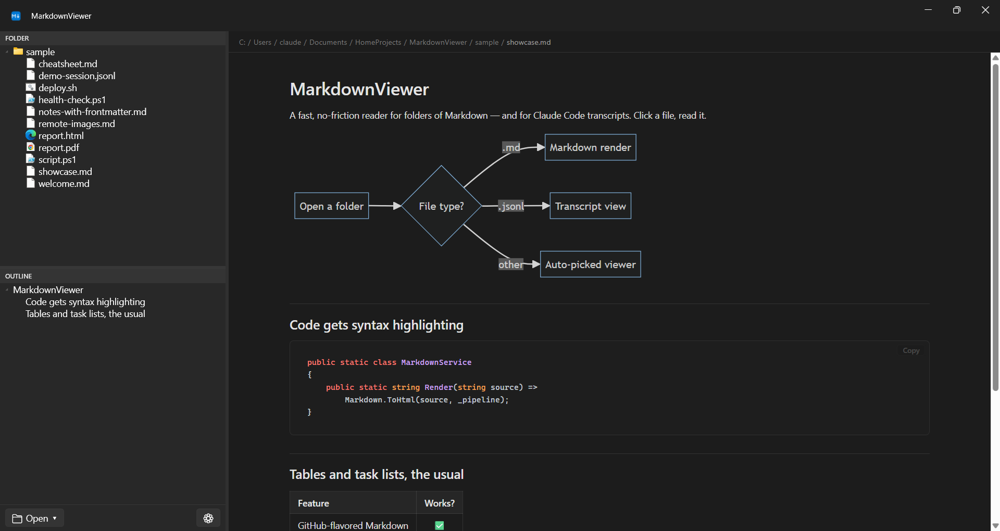
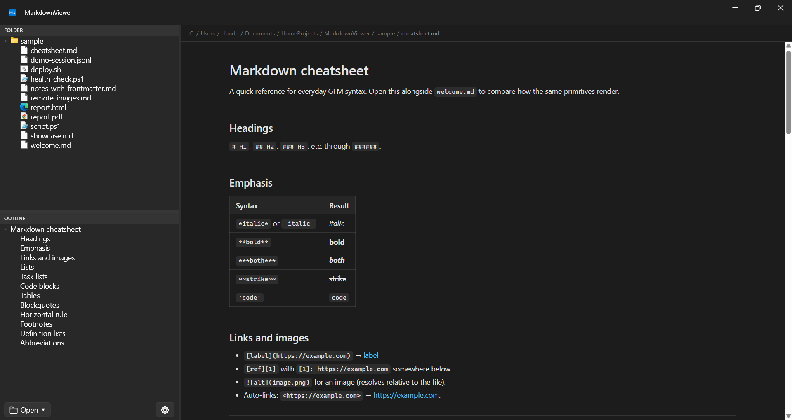
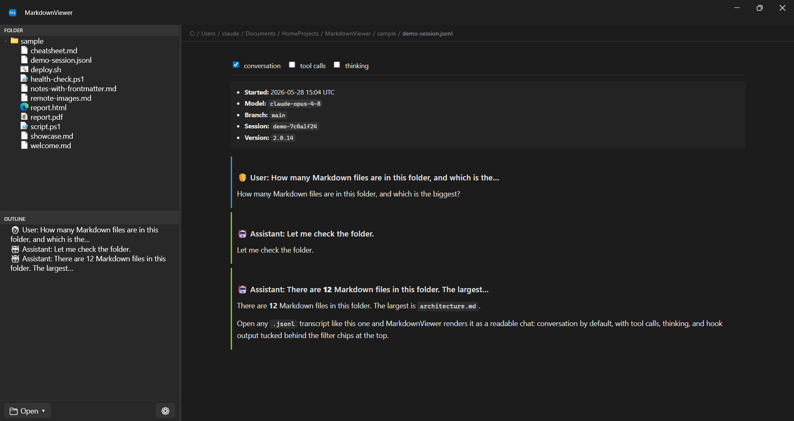
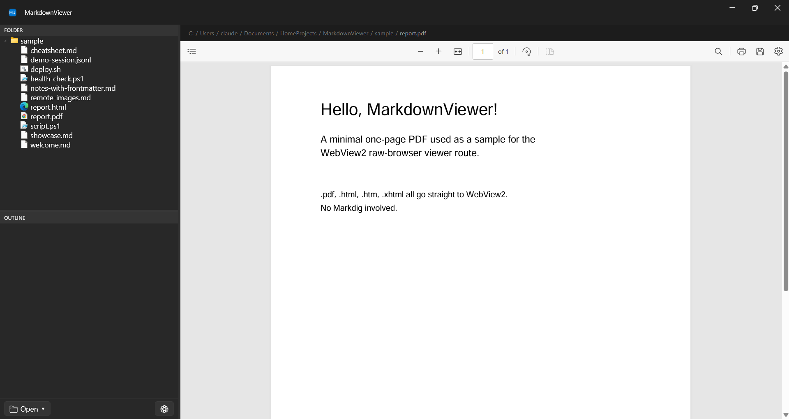

# MarkdownViewer

**A fast, no-friction Windows reader for folders full of Markdown — and for Claude Code transcripts.** Point it at a folder, click a file, read. That's the whole app.



`Windows 11` · `.NET 10` · `WPF + WebView2` · `100% vibe-coded` 🤖

---

## ⚠️ First, the honest part: this is entirely vibe-coded

I did not write this. I have not *read* this.

Every line of C#, XAML, CSS, and JavaScript in this repo was produced by Claude. I described what I wanted, looked at the running app, said "no, the find bar should float" or "dark mode selection is unreadable," and Claude changed the code. I reviewed the **behavior**, never the **source**.

I think of it the way I think of a compiler: I write the high-level intent, a machine emits the implementation, and I judge the result by whether it runs correctly — not by reading the assembly it spat out. The C# *is* the assembly here. I'm sure it's fine. I haven't looked. I'm not going to.

So:

- 🧠 **Architecture decisions?** Claude's.
- 🧪 **The 146 passing unit tests?** Claude wrote them. I have not read those either. They're green, which I choose to find reassuring.
- 🐛 **Bugs?** Statistically certain. Found by using it, not by auditing it.
- 📚 **The very detailed design docs in this repo** (`markdownviewer.md`, `theming.md`, `transcripts.md`)? Also Claude's. They're more thorough than docs I'd write for code I *had* read.

If that makes you twitch, this is your exit. No hard feelings.

## Should you use this? Probably not.

Let me be clear: I'm not pitching this to you. It's a personal tool that happens to live in a public repo.

It is **perfect for my workflow** — I read a lot of Markdown notes and a lot of Claude Code session transcripts on Windows, and nothing off-the-shelf did both the way I wanted. So I had one built. It does exactly what *I* need.

Your workflow is not my workflow. You probably want one of the many mature, human-authored Markdown viewers maintained by people who can confidently tell you what happens on line 200. That's a real and good preference. Go enjoy it.

But if you're still reading, here's what it actually does.

## What it actually does

### Renders Markdown the way you'd hope



Full GitHub-Flavored Markdown via [Markdig](https://github.com/xoofx/markdig):

- **Tables, task lists, footnotes, definition lists, autolinks, abbreviations** — the whole GFM kit.
- **Mermaid diagrams**, rendered inline (bundled locally — works with the network unplugged).
- **Syntax highlighting** via highlight.js, also bundled, also no CDN.
- **Math syntax** is recognized — though I'll be honest, KaTeX isn't wired up yet, so `$E = mc^2$` currently renders plain. It's on the list. (The list is also Claude's.)
- YAML frontmatter is quietly stripped instead of dumped on screen as `--- title: ... ---`.

### Reads Claude Code transcripts as a real conversation

This is the feature I actually built it for.



Drop a `.jsonl` Claude Code transcript in any folder and it renders as a readable chat instead of one-line-per-record JSON soup:

- A **session header** with model, branch, version, and session ID.
- **Conversation shown by default**, with tool calls, thinking blocks, hook output, skill listings, and MCP noise tucked behind **filter chips** at the top — toggle on only what you want to see.
- Tool calls pair their input with their output and collapse into tidy `<details>` blocks.
- Your filter choices persist between files.

### Opens basically anything you click



It's a Markdown viewer that doesn't sulk when you click a non-Markdown file. A content router picks the right viewer by extension:

| You click… | You get… |
|---|---|
| `.md` `.markdown` | The Markdown renderer above |
| `.jsonl` | The transcript chat view above |
| `.pdf` | WebView2's native PDF viewer (shown here) |
| `.html` `.htm` | Rendered in the embedded browser |
| images | Inline, on a checkerboard background |
| `.ps1` `.py` `.cs` `.json` … | Plain-text viewer with syntax highlighting |
| anything binary | A polite placeholder instead of a screenful of `�` |

### …and a pile of quality-of-life stuff

- 🔁 **Live reload.** Edit a note in another app and the view updates — even when MarkdownViewer isn't focused. Backed by a `FileSystemWatcher`; your scroll position is preserved.
- 🔍 **Find in page** (`Ctrl+F`), floating over the content, powered by WebView2's native find.
- 🗂️ **Folder tree + document outline** in a resizable sidebar. The outline is built from the headings of whatever you're reading.
- 🎨 **Fluent / Mica chrome** that follows your Windows light/dark setting and accent color automatically. Pick a **Win11** or **GitHub** body style for the rendered content.
- 🚪 **Several ways in:** command-line arg, drag-and-drop, an Explorer right-click "Open in MarkdownViewer," and optional `.md` / `.jsonl` file associations.
- 💾 **Remembers where you were** — last folder, last file, window position, pinned and recent folders.
- ⌨️ **Keyboard shortcuts** for everything you'd expect (see below).

## Install / build / run

Requires the **.NET 10 SDK** and the **WebView2 Runtime** (preinstalled on Windows 11).

```powershell
# Build
dotnet build src\MarkdownViewer.csproj -c Release

# Run the tests Claude wrote and I did not read
.\test.ps1

# Publish a small single-file exe (needs the .NET 10 Desktop Runtime on the target)
dotnet publish src\MarkdownViewer.csproj -c Release -r win-x64 `
    -p:PublishSingleFile=true `
    -p:IncludeNativeLibrariesForSelfExtract=true `
    --self-contained false `
    -o publish
```

Then:

```powershell
.\MarkdownViewer.exe                    # reopen last folder + file
.\MarkdownViewer.exe C:\Notes           # open a folder
.\MarkdownViewer.exe C:\Notes\foo.md    # open the folder, select the file
```

Optional Explorer right-click menu and file associations:

```powershell
.\installer\Install-ContextMenu.ps1 -ExePath '<full path to MarkdownViewer.exe>'
.\installer\Install-FileAssociations.ps1   # offers .md / .jsonl in "Open with"
```

## Keyboard shortcuts

| Key | Action |
|---|---|
| `Ctrl+O` | Open folder |
| `Ctrl+F` | Find in page |
| `Ctrl+,` | Preferences |
| `Ctrl+B` | Toggle sidebar |
| `Ctrl+1` / `Ctrl+2` | Focus folder tree / outline |
| `Ctrl+R` / `F5` | Reload current file |
| `Esc` | Close find bar |
| `Ctrl++` / `Ctrl+-` / `Ctrl+0` | Font size |

## The stack (that I did not write)

C# on .NET 10, a WPF shell with [WPF-UI](https://github.com/lepoco/wpfui) for the Fluent/Mica look, and a single Microsoft Edge **WebView2** filling the content pane. Markdown is [Markdig](https://github.com/xoofx/markdig); diagrams are [Mermaid](https://mermaid.js.org/); code highlighting is [highlight.js](https://highlightjs.org/). Mermaid and highlight.js are bundled locally — no CDN calls. Settings live in `%APPDATA%\MarkdownViewer\settings.json`.

Windows 11 only. No Mac, no Linux, no plans for either.

## License

Do whatever you want with it. It's vibe-coded; I can hardly claim it as craftsmanship. If it breaks, you get to keep both pieces.
