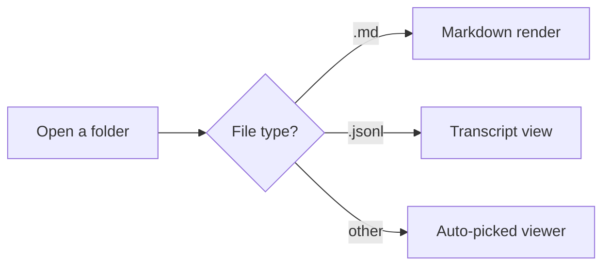

# MarkdownViewer

A fast, no-friction reader for folders of Markdown — and for Claude
Code transcripts. Click a file, read it.



## Code gets syntax highlighting

```csharp
public static class MarkdownService
{
    public static string Render(string source) =>
        Markdown.ToHtml(source, _pipeline);
}
```

## Tables and task lists, the usual

| Feature | Works? |
|---|:---:|
| GitHub-flavored Markdown | ✅ |
| Mermaid diagrams | ✅ |
| Syntax highlighting | ✅ |
| JSONL transcript viewer | ✅ |

- [x] Open a folder
- [x] Read a file
- [ ] Think about the code underneath (please don't)
