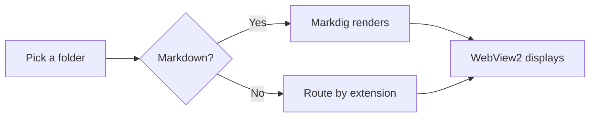
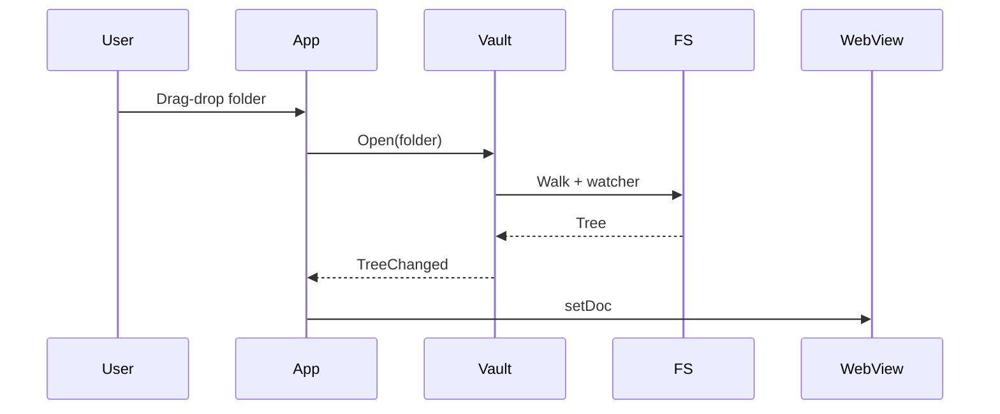

# Helloa

## New

### ASDF

#### qwerqwerqwer

##### qedfasdfgasdfasdf

## Test no emoji

Hello

### ✅ Level 3 a

#### Level 4 a

### Level 3 b

## ✅ Test with emoji

### Level 3 c

### Level 3 d

# MarkdownViewer

A small, fast Windows markdown reader for folders of `.md` files. This page
is a smoke test for the most important rendering features.

## Headings and paragraphs

This is a paragraph with **bold**, *italic*, ~~strikethrough~~, and
`inline code`. Links go to [example.com](https://example.com).

### A level-three heading

Soft line
breaks render as spaces, matching GitHub README rendering.

A hard break is two trailing spaces  
on the previous line.

## Lists

- Unordered item
- Another item
  - Nested
  - Also nested
- Back to top level

1. First
2. Second
3. Third

### Task list (read-only)

- [x] Set up the project
- [x] Render markdown
- [ ] Polish styling
- [ ] Add tests

## Code

Inline `code` is monospaced. Block code with a language gets syntax
highlighted by highlight.js:

```csharp
public static class MarkdownService
{
    public static string Render(string source)
        => Markdown.ToHtml(source, _pipeline);
}
```

```powershell
$exe = (Resolve-Path .\MarkdownViewer.exe).Path
Set-ItemProperty -Path 'HKCU:\Software\Classes\Directory\shell\Open' `
    -Name '(default)' -Value 'Open in MarkdownViewer'
```

```python
def greet(name):
    print(f"hello, {name}")
```

## Tables

| Feature | Status | Notes |
|---|---|---|
| Markdown | ✅ | GFM via Markdig |
| Mermaid | ✅ | Bundled |
| PDF | ✅ | WebView2 native viewer |
| HTML | ✅ | Embedded |

## Blockquote

> This is a blockquote.
>
> It can span multiple paragraphs.

## Math

Inline math: $E = mc^2$.

Display math:

$$\sum_{i=1}^{n} i = \frac{n(n+1)}{2}$$

(Math rendering is just monospace placeholder for v1 — no KaTeX/MathJax yet.)

## Mermaid





## Footnotes

Markdig handles footnotes[^1] just fine.

[^1]: Like this one.

## Horizontal rule

---

End of smoke test. If you can read this, the renderer is working.
